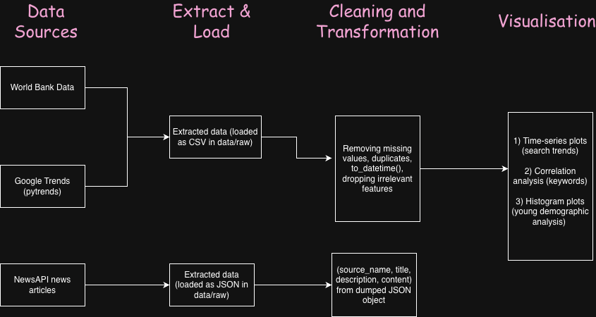

# AI620: Fundamentals of Data Engineering: Assignment 1

## Building a Modern EL Pipeline
**Theme: Pakistan's Digital Payments Landscape**

---

### Data Sources:

This pipeline extracts data from World Bank Group's [Data360](https://data360.worldbank.org/en/dataset/WB_FINDEX) portal, historical popularity data of related search keywords on Google (using the Google Trends API), and related news articles from NewsAPI.

### Pipeline Architecture

### Running the Pipeline

1. Install dependencies with `pip install -r requirements.txt`
2. Set API keys in `.env` file (your NewsAPI key)
3. Run `python run_pipeline.py` to start the EL pipeline
4. **Analysis**: Run the `python src/exploratory_analysis.ipynb` notebook for some analysis.

The pipeline will extract, transform, and load data into the specified output format for further analysis.

---
*Note: Answers to the given questions are given in the `docs/part_1_questions.md` and `docs/part_2_questions.md`*